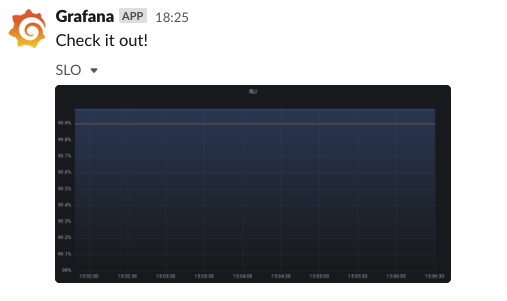

# grafana-image-to-slack

A server that capture an image of Grafana panel and post it to Slack.

## Prerequisite

- Grafana
  - Install Grafana Image Renderer plugin
  - Issue API Key (Viewer)
- Slack
  - Issue Bot token with `files:write` scope

## Usage

```shell
cat payload.json
{
  "channel": "test",
  "title": "SLO",
  "comment": "Check it out!",
  "grafana_image_url": "https://xxx.grafana.net/render/..."
}

SLACK_TOKEN=... GRAFANA_API_KEY=... go run ./main.go &
curl -XPOST -H 'content-type: application/json' -d@payload.json localhost:8080
```

You will see like


